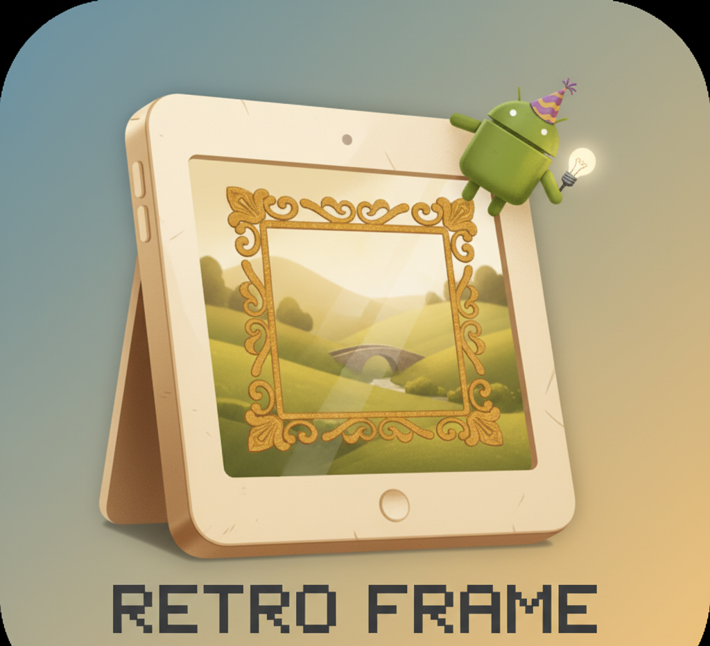

<div align="center">



# RetroFrame

**Give your old tablet a second life as a digital photo frame.**

Point it at a folder. It shows your photos. That's the whole app.

[](LICENSE)
[](#compatibility)
[](https://github.com/YOUR-GITHUB-USERNAME/retroframe/actions/workflows/ci.yml)
[](https://kotlinlang.org)

</div>

---

## Why this exists

There is a drawer in most homes with a tablet in it. It still turns on. The battery is
tired, the browser is too old for the modern web, and nobody has touched it in three
years. It is not broken — it is just no longer useful.

A tablet is a screen, a power port, and some storage. That is exactly a digital photo
frame, and commercial photo frames cost real money to do less.

RetroFrame is built for that device specifically. Not for a flagship phone that happens
to also run it — for a 2015 tablet with 1 GB of RAM, a slow eMMC chip, and an Android
version that stopped getting updates a long time ago.

That single constraint drives every decision in this project:

- **No account. No cloud. No network.** Your photos are read from a folder you pick, and
  they never leave the device. The app does not have — and will not add — an analytics
  SDK, a crash reporter, or a login screen.
- **Nothing runs that doesn't have to.** No always-on foreground service, no background
  sync, no push. The screen turns off when you tell it to.
- **It has to survive being ignored.** The intended usage is "plug it in, mount it on a
  shelf, never think about it again." Individual failures — a corrupt JPEG, a video codec
  the device doesn't have, a folder that vanished — must never take down the slideshow.

## Features

**Slideshow**
- Reads any folder you pick, including SD cards and USB storage
- Photos: JPEG, PNG, GIF, BMP, WebP
- Videos: MP4, MKV, WebM, AVI, MOV — muted by default, plays fully, then advances
- Adjustable interval (5 seconds to 1 hour)
- Pinch-to-zoom on any photo
- Detects photos added to or removed from the folder while running

**Favourites**
- Tap the heart on a photo you love, and it comes around roughly 3× as often
- Persists across restarts

**Clock mode**
- A big, legible fullscreen clock — good for a bedside or kitchen shelf
- Switch manually, or let the sleep schedule do it automatically

**Scheduling** — the part that makes it usable as a permanent fixture
- **Wake time:** turns the screen on and starts the slideshow (e.g. 07:00)
- **Sleep time:** drops to clock mode and releases the screen so it can turn off (e.g. 23:00)
- **Morning alarm:** an optional daily alarm with sound and a notification
- **Auto-start on boot:** survives the inevitable power cut

**Deliberately minimal UI**
- Fullscreen and immersive — no status bar, no navigation bar, no chrome
- Controls are hidden until you tap, then hide themselves again after 3 seconds
- Large touch targets, sized for old low-resolution panels and imprecise digitisers

## Compatibility

| | |
|---|---|
| **Minimum** | Android 5.1 Lollipop (API 22) |
| **Target** | Android 14 (API 34) — [see below](#a-note-on-current-status) |
| **Tested on** | Please [tell us what you ran it on](../../issues/new?template=device_report.yml) |
| **Architecture** | Any — no native code |
| **RAM** | Designed for 1 GB devices |

Android 5.1 is a deliberate floor. It covers essentially every tablet worth rescuing.
Anything older cannot use the Storage Access Framework, which is how the app reads your
folder without demanding blanket access to all your files.

## Install

### Build it yourself

The only currently supported route. You need [Android Studio](https://developer.android.com/studio)
or a JDK 17 and the Android SDK.

```bash
git clone https://github.com/YOUR-GITHUB-USERNAME/retroframe.git
cd retroframe
./gradlew assembleDebug          # Windows: gradlew.bat assembleDebug
```

The APK lands in `app/build/outputs/apk/debug/app-debug.apk`. Install it with:

```bash
adb install -r app/build/outputs/apk/debug/app-debug.apk
```

Or copy the APK to the tablet and open it — you will need to allow installation from
unknown sources.

### Distribution channels

| Channel | Status |
|---|---|
| GitHub Releases | Planned — see [#roadmap](#roadmap) |
| F-Droid | Planned. GPL-3.0 and a dependency tree with no proprietary blobs make this a good fit. |
| Google Play | Under consideration — [read the tradeoffs](docs/PUBLISHING.md) |
| Apple App Store | Not planned. [Here's why](docs/PUBLISHING.md#what-about-ios). |

## Setting it up

1. **Put your photos somewhere on the tablet.** An SD card is ideal — it keeps them off
   the small internal storage and lets you swap the card to update the collection.
2. **Launch RetroFrame.** On first run it opens the system folder picker. Choose the
   folder with your photos. The app keeps permission to that folder only.
3. **Tap the screen** to reveal the controls, then tap the gear to open settings.
4. **Set your interval** — 30 to 60 seconds is comfortable for a frame you actually live with.
5. **Set wake and sleep times** in 24-hour `HH:mm` format. Leave blank to disable.
6. **Enable auto-start on boot** so a power cut doesn't leave you with a blank screen.
7. **Plug it in and leave it.** RetroFrame keeps the screen on during photo mode.

### Physical setup tips

- **Heat kills batteries.** A tablet permanently on charge, permanently displaying a bright
  screen, will run hot and the battery will swell over months or years. If you can open the
  device and run it without the battery, do. Otherwise, use the sleep schedule aggressively
  and give it airflow.
- **Turn brightness down.** Full brightness is rarely necessary indoors and is the single
  biggest source of both heat and power draw.
- **Disable the lock screen** on the tablet, or wake-from-schedule will land on the lock
  screen instead of your photos.
- **A cheap tablet stand plus a right-angle USB cable** looks dramatically better than the
  device flat against a wall with a cable hanging off it.

## Settings reference

| Setting | Default | Notes |
|---|---|---|
| Slide interval | 10s | Accepts 5–3600 seconds |
| Shuffle | off | ⚠️ Currently non-functional — see [Known issues](docs/KNOWN_ISSUES.md) |
| Include videos | on | Off makes the app noticeably lighter on old hardware |
| Video sound | off | Videos are muted unless you turn this on |
| Wake time | disabled | `HH:mm`, 24-hour |
| Sleep time | disabled | `HH:mm`, 24-hour |
| Morning alarm | disabled | `HH:mm`, plays the system alarm sound |
| Auto-start on boot | off | Requires the app to be launched at least once first |

Wake, sleep, and alarm all use exact alarms. On Android 12 and newer the system may
require you to grant *Alarms & reminders* permission manually under
**Settings → Apps → RetroFrame**.

## How it works

Kotlin, Android Views, roughly 1,600 lines. No Compose, no dependency injection framework,
no multi-module setup — all of which would cost startup time and APK size on a device that
has neither to spare.

```
MainActivity ──── swaps between two fragments ────┬── SlideshowFragment (screen kept on)
     │                                            └── ClockFragment     (screen may sleep)
     │
     └── AlarmManager (exact alarms) ──► ScreenManager.AlarmReceiver
                                              ├── wake  → WakeLock + launch in PHOTO mode
                                              └── sleep → launch in CLOCK mode

SlideshowFragment ── ViewPager2 ── SlideshowAdapter ──┬── Glide      → PhotoView (images)
        │                                             └── ExoPlayer  → PlayerView (video)
        └── SlideshowViewModel ── PhotoRepository ── Storage Access Framework
                                        └── FavoritesManager (weighting)
```

A fuller write-up — including why some of these choices are wrong and what should replace
them — is in **[docs/ARCHITECTURE.md](docs/ARCHITECTURE.md)**.

## A note on current status

**RetroFrame works, but it is not yet polished.** It builds, installs, and runs a slideshow
reliably. It has also never been released, has no automated tests, and carries a handful of
known defects — including a settings toggle that does nothing and a folder watcher that
polls far more aggressively than it should on exactly the hardware this app targets.

All of it is written down in **[docs/KNOWN_ISSUES.md](docs/KNOWN_ISSUES.md)**, with severity
and suggested fixes. Nothing is hidden. If you are looking for somewhere to start
contributing, that file is the to-do list.

Version numbers stay below `1.0` until the release blockers in that document are cleared.

## Roadmap

**Before 1.0 — release blockers**
- [ ] Add the missing `proguard-rules.pro` so release builds work at all
- [ ] Replace the 10-second folder polling with something that doesn't wake the CPU constantly
- [ ] Make the shuffle setting actually shuffle
- [ ] Stop the slideshow jumping position when a photo is favourited
- [ ] Adaptive launcher icon and proper density buckets
- [ ] Drop the unused Retrofit / Gson / DataStore dependencies
- [ ] A signed release build and a first GitHub Release

**After 1.0 — wanted**
- [ ] Recursive subfolder scanning
- [ ] Transition effects — the preference exists, the implementation does not
- [ ] Analog clock face — same story
- [ ] Sort by date / name, not just random
- [ ] Per-photo captions
- [ ] Translations
- [ ] Migrate ExoPlayer2 → AndroidX Media3 (the current API is deprecated)

**Explicitly not planned**
- Cloud photo services (Google Photos, iCloud, Dropbox). They require accounts, network
  permissions, and API keys, and they contradict the point of the project.
- Any form of telemetry or analytics.
- An iOS version — [reasoning here](docs/PUBLISHING.md#what-about-ios).

## Contributing

Contributions are genuinely welcome, and **device reports are as valuable as code**. If you
have an old tablet, running RetroFrame on it and reporting what happened is a real
contribution — that hardware is impossible to buy and impossible to emulate faithfully.

See **[CONTRIBUTING.md](CONTRIBUTING.md)** to get started, and
**[docs/KNOWN_ISSUES.md](docs/KNOWN_ISSUES.md)** for things that need doing.

By participating you agree to the [Code of Conduct](CODE_OF_CONDUCT.md).

## License

RetroFrame is free software, licensed under the **[GNU General Public License v3.0](LICENSE)**.

You may use, study, share, and modify it. If you distribute a modified version, you must
release your changes under the same license. This is deliberate: the project exists to keep
old hardware out of landfill, and that goal is not served by someone repackaging it as a
closed-source app with ads.

```
Copyright (C) 2025 RetroFrame contributors

This program is free software: you can redistribute it and/or modify it under the
terms of the GNU General Public License as published by the Free Software Foundation,
either version 3 of the License, or (at your option) any later version.

This program is distributed in the hope that it will be useful, but WITHOUT ANY
WARRANTY; without even the implied warranty of MERCHANTABILITY or FITNESS FOR A
PARTICULAR PURPOSE. See the GNU General Public License for more details.
```

## Built with

[Glide](https://github.com/bumptech/glide) ·
[ExoPlayer](https://github.com/google/ExoPlayer) ·
[PhotoView](https://github.com/Baseflow/PhotoView) ·
[AndroidX](https://developer.android.com/jetpack/androidx)

---

<div align="center">
<sub>Every tablet kept out of a landfill is a small win.</sub>
</div>
