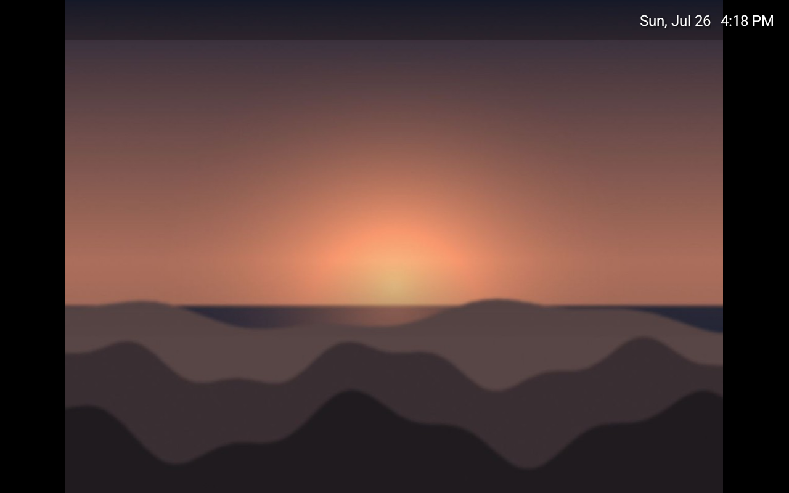
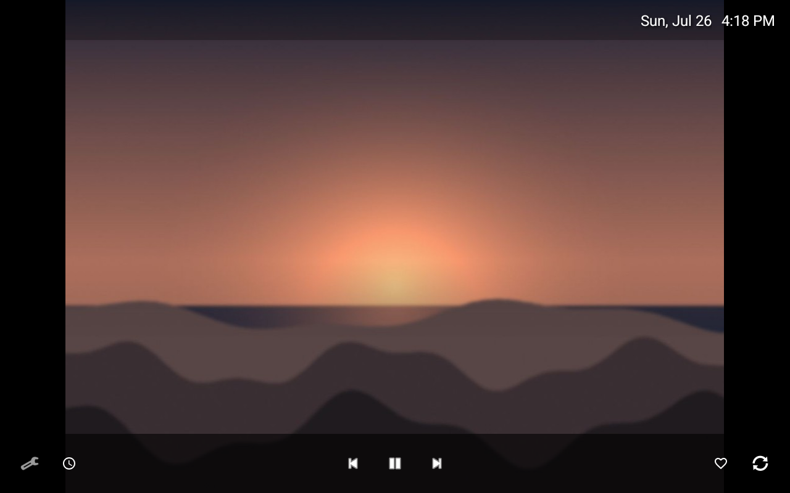
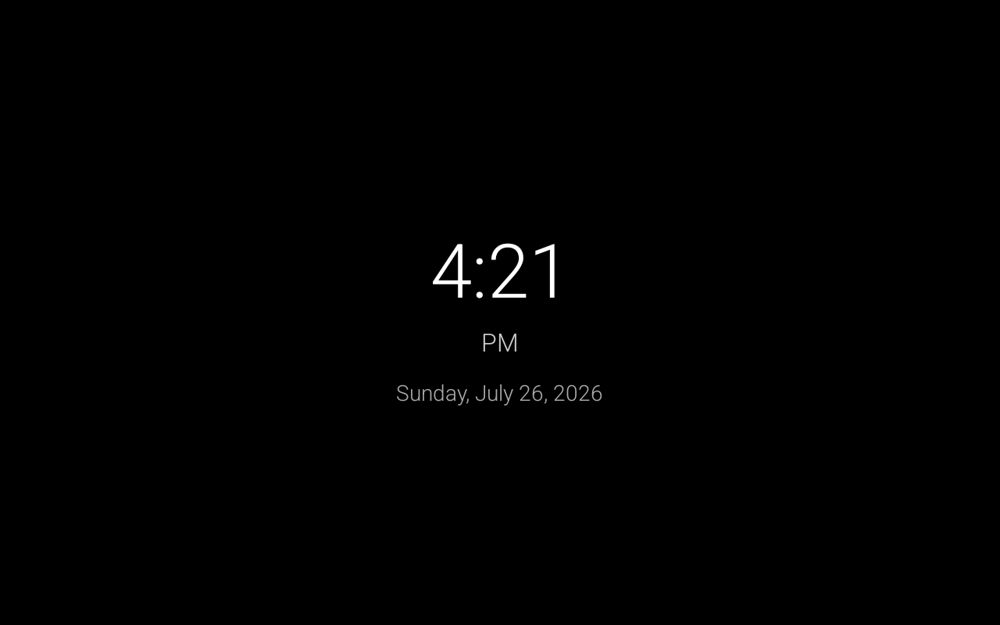
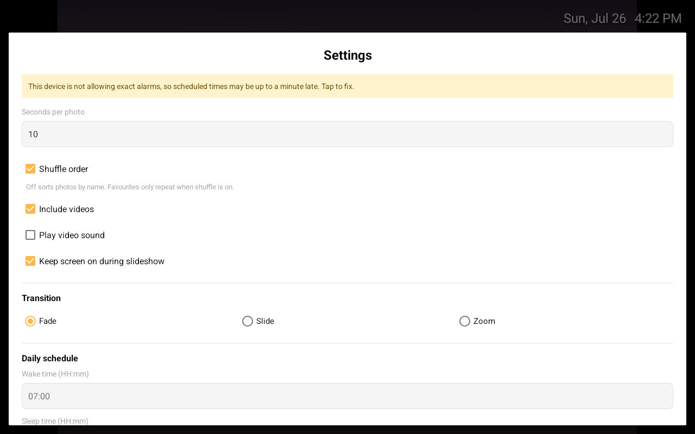

<div align="center">


# RetroFrame

**Turn an old Android tablet into a digital photo frame.**

Point it at a folder. It shows your photos. That's the whole app.

[](LICENSE)
[](#compatibility)
[](https://github.com/RobTar97/retroframe/actions/workflows/ci.yml)
[](https://github.com/RobTar97/retroframe/actions/workflows/device-tests.yml)
[](https://kotlinlang.org)
[](#privacy)

**[retroframe website →](https://robtar97.github.io/retroframe/)**  ·  **[Download v0.3.0 (3.1 MB) →](https://github.com/RobTar97/retroframe/releases/latest)**

<br>






<sub>Captured on a 1280×800 tablet emulator. Real-hardware shots welcome.</sub>

</div>

---

RetroFrame is a free, open source **digital photo frame app for Android tablets**. It runs a
fullscreen photo slideshow from one folder on the device, works entirely **offline**, and needs
**no account, no cloud service and no subscription**. It supports **Android 5.1 and newer**, so
it revives old tablets that modern photo frame apps have stopped supporting.

## Why this exists

There is a drawer in most homes with a tablet in it. It still turns on. The battery is tired,
the browser is too old for the modern web, and nobody has touched it in three years. It is not
broken — it is just no longer useful.

A tablet is a screen, a power port, and some storage. That is exactly a digital photo frame,
and commercial photo frames cost real money to do less.

RetroFrame is built for that device specifically. Not for a flagship phone that happens to
also run it — for a 2015 tablet with 1 GB of RAM, a slow eMMC chip, and an Android version
that stopped getting updates a long time ago.

That single constraint drives every decision in this project:

- **No account. No cloud. No network.** The app does not declare the `INTERNET` permission, so
  this is enforced by the manifest rather than promised in a README.
- **Nothing runs that doesn't have to.** No foreground service, no background sync, no push.
  The folder is watched by a `ContentObserver` that costs nothing until something changes.
- **It has to survive being ignored.** The intended use is "plug it in, put it on a shelf,
  never think about it again." A corrupt JPEG, a missing codec, a folder that vanished — none
  of them may take down the slideshow.

## Features

**Slideshow**
- Reads any folder you pick, including SD cards and USB storage
- Looks inside folders within it too, up to five levels deep — point it at `Photos` and it
  finds `Photos/2019/Italy`
- Photos: JPEG, PNG, GIF, BMP, WebP, HEIC
- Videos: MP4, MKV, WebM, AVI, MOV, 3GP — muted by default, played to the end, then advances
- Adjustable interval, 5 seconds to 1 hour
- Fade, slide or zoom transitions
- Pinch-to-zoom on any photo
- Notices photos added to or removed from the folder while running

**Favourites**
- Tap the heart and that photo comes around about 3× as often
- Spaced out so a favourite never appears twice in a row

**Clock mode**
- A big, legible fullscreen clock — good for a bedside or kitchen shelf
- Switch manually, or let the sleep schedule do it

**Scheduling** — what makes it usable as a permanent fixture
- **Wake time:** turns the screen on and starts the slideshow
- **Sleep time:** drops to clock mode and releases the screen so it can turn off
- **Night dimming:** hold clock mode at any brightness you like. No permission needed, and
  Android undoes it as soon as the app loses focus
- **Morning alarm:** optional daily alarm with sound, over the lock screen
- **Auto-start on boot:** survives the inevitable power cut

**Built to be left alone for years**
- **Burn-in protection:** the clock drifts a few millimetres a minute, so it cannot ghost
  itself permanently into an OLED panel
- Times are set with the system clock picker, not typed as `HH:mm`

**Deliberately minimal UI**
- Fullscreen and immersive — no status bar, no navigation bar, no chrome
- Controls hidden until you tap, then gone again after 3 seconds
- Large touch targets, sized for old low-resolution panels and imprecise digitisers

## Privacy

RetroFrame collects nothing, transmits nothing, and has nowhere to send anything.

| | |
|---|---|
| Network access | **None.** `INTERNET` is not in the manifest |
| Accounts | None |
| Analytics / crash reporting | None, and none will be accepted — see [CONTRIBUTING](CONTRIBUTING.md) |
| Storage access | One folder, chosen by you through the system picker. Read-only |
| Permissions | Boot, wake lock, alarms, notifications. That is the complete list |

The permission list is not a promise — it is
[asserted by a test](app/src/androidTest/java/com/rober/photoframe/ManifestInstrumentedTest.kt)
that runs on real emulators on every push, and fails the build if a dependency ever merges a
fifth permission in. One already tried: Media3 injects `ACCESS_NETWORK_STATE` for adaptive
streaming this app never does, and it is actively removed from the manifest.

Full details, including where the app's rights under GDPR, CCPA and COPPA land and how to
verify any of it yourself, are in **[PRIVACY.md](PRIVACY.md)**.

## Compatibility

| | |
|---|---|
| **Minimum** | Android 5.1 Lollipop (API 22) |
| **Target** | Android 16 (API 36) |
| **Tested on** | Nothing yet — [please report what you run it on](../../issues/new?template=device_report.yml) |
| **Architecture** | Any — no native code |
| **RAM** | Designed for 1 GB devices |
| **Release APK** | ~3 MB |

Android 5.1 is a deliberate floor: it covers essentially every tablet worth rescuing. Anything
older lacks the Storage Access Framework, which is how the app reads your folder without
demanding access to all your files.

## Install

### Download a build

Grab the signed APK from the [latest release](https://github.com/RobTar97/retroframe/releases/latest),
copy it to your tablet and open it. You will need to allow installation from unknown sources.

Verify it first if you like — every release lists the APK's SHA-256:

```bash
sha256sum retroframe-v0.3.0.apk
```

### Build it yourself

You need [Android Studio](https://developer.android.com/studio), or JDK 17 plus the
Android SDK.

```bash
git clone https://github.com/RobTar97/retroframe.git
cd retroframe
./gradlew assembleDebug          # Windows: gradlew.bat assembleDebug
adb install -r app/build/outputs/apk/debug/app-debug.apk
```

### Distribution channels

| Channel | Status |
|---|---|
| [GitHub Releases](https://github.com/RobTar97/retroframe/releases) | **Available now** — signed APK with a published checksum |
| F-Droid | Planned. GPL-3.0, no proprietary dependencies, no Play Services — a good fit |
| Google Play | Under consideration — [tradeoffs here](docs/PUBLISHING.md) |
| Apple App Store | Not planned. [Why not](docs/PUBLISHING.md#what-about-ios) |

## Setting it up

**New to this? → [Getting started](docs/GETTING_STARTED.md)** walks through it with no
assumed knowledge. **Not sure which tablet? → [Choosing a tablet](docs/CHOOSING_A_TABLET.md).**

The short version:

1. **Copy your photos into `Pictures`** on the tablet — over a USB cable (choose *File
   transfer* on the tablet, not just charging), or on an SD card. A dedicated subfolder like
   `Pictures/Frame` keeps things tidy.
2. **Install the APK** from [the latest release](https://github.com/RobTar97/retroframe/releases/latest)
   and allow installation from unknown sources when asked.
3. **Open RetroFrame.** It explains what happens next, then opens Android's folder browser
   already inside `Pictures`. Open your folder, tap **Use this folder**, then **Allow**.
4. **Tap the screen → ⚙** and set the interval, plus wake and sleep times in 24-hour `HH:mm`.
   Turn on auto-start so a power cut doesn't leave a black screen.

> **If Android says "Can't use this folder"** you've selected the top level of storage or the
> Downloads folder. Android blocks both for every app. Open a folder inside, or move the
> photos into `Pictures`. Verified: root ❌, `Download` ❌, `Pictures` ✅, `DCIM` ✅.

### Physical setup tips

- **Heat kills batteries.** A tablet permanently charging with a bright screen runs hot, and
  the battery will swell over months or years. If you can run it without the battery, do.
  Otherwise use the sleep schedule aggressively and give it airflow.
- **Turn the brightness down.** Full brightness is rarely needed indoors and is the biggest
  source of both heat and power draw.
- **Disable the lock screen**, or the wake schedule lands on it instead of your photos.
- **A cheap stand and a right-angle USB cable** look dramatically better than a tablet flat
  against a wall with a cable hanging off it.

## Settings reference

| Setting | Default | Notes |
|---|---|---|
| Seconds per photo | 10 | 5–3600 |
| Shuffle order | on | Off sorts by name, and IMG_2 comes before IMG_10 |
| Include videos | on | Off makes the app noticeably lighter on old hardware |
| Play video sound | off | Videos are muted unless you enable this |
| Keep screen on | on | Off lets the device's own display timeout apply |
| Transition | Fade | Fade, Slide or Zoom |
| Wake time | disabled | `HH:mm`, 24-hour |
| Sleep time | disabled | `HH:mm`, 24-hour |
| Morning alarm | disabled | `HH:mm`, plays the system alarm sound |
| Auto-start on boot | off | The app must have been launched once first |

Favourite weighting applies only when shuffle is on — repeating a photo inside a name-sorted
list would just show it three times in a row.

The wake and sleep schedule uses inexact alarms and works everywhere. Only the morning alarm
wants exact timing; on Android 12+ the settings screen will tell you if the system is
withholding that permission, and offer to take you there.

## How it works

Kotlin, Android Views, about 2,000 lines. No Compose, no DI framework, no multi-module setup —
each would cost startup time and APK size on a device that has neither to spare.

```
MainActivity ──── swaps two fragments ────┬── SlideshowFragment (screen kept on)
     │                                    └── ClockFragment     (screen may sleep)
     │
     └── AlarmCompat ──► DailySchedule.AlarmReceiver
                              ├── wake  → wake lock + launch in PHOTO mode
                              └── sleep → launch in CLOCK mode

SlideshowFragment ── ViewPager2 ── SlideshowAdapter ──┬── ImageLoader (Glide) → PhotoView
        │                                             └── SharedPlayer (Media3) → PlayerView
        │
        └── SlideshowViewModel ──┬── PhotoRepository  → one SAF cursor query
                                 ├── PlaylistBuilder  → sort, weight, interleave
                                 └── FolderMonitor    → ContentObserver
```

Three decisions carry most of the performance:

- **The folder is scanned with one cursor query**, not `DocumentFile.listFiles()`. The latter
  costs an IPC round trip per file *per property* — about 1,500 calls for a 500-photo folder.
- **The folder is watched with a `ContentObserver`**, not a timer. The previous version polled
  every 10 seconds, forever.
- **One video player is shared by the whole slideshow.** ViewPager2 keeps offscreen pages
  alive, so a player per page meant up to three decoder sessions on a device with one decoder.

Full write-up in **[docs/ARCHITECTURE.md](docs/ARCHITECTURE.md)**.

## Project status

**Version 0.3.0 — [released](https://github.com/RobTar97/retroframe/releases/latest), but unproven on real hardware.**

The app builds cleanly, R8-minifies to ~3 MB, and passes 52 unit tests plus 14 instrumented
tests run on emulators at **API 22, 28 and 36** on every push. Version 0.2.0 was a substantial
rewrite that fixed a long list of real defects — including a crash on Android 5.1 that had been
latent since the beginning, a release build that could never be produced at all, and a folder
watcher that hammered the storage provider every 10 seconds. Version 0.3.0 added the things a
device left on a shelf actually needs: subfolder scanning, night dimming and burn-in protection.

**It still has not run on a physical tablet.** CI proves the code executes on Android 5.1; it
proves nothing about a 2015 vendor ROM's storage provider, its single hardware video decoder,
its power management, or how warm it gets after a fortnight on a shelf. That is the honest
state of it, and it is the first entry in [docs/KNOWN_ISSUES.md](docs/KNOWN_ISSUES.md) rather
than something you find out after installing.

If you have an old tablet, **running this and telling us what happened is the most useful
thing you can do for the project** — more useful than code.

**[Send a device report →](../../issues/new?template=device_report.yml)**

## Roadmap

**Towards 1.0**
- [x] ~~Signed release and a first GitHub Release~~
- [ ] Verify the rewrite on real hardware across several Android versions
- [ ] Recursive subfolder scanning
- [ ] Loading indicator while a large folder is scanned
- [ ] Video poster frames instead of a flash of black
- [ ] Screenshots taken on a real tablet
- [ ] F-Droid submission

**Later**
- [ ] Sort by date as well as name
- [ ] Per-photo captions
- [ ] Translations
- [ ] Analog clock face

**Explicitly not planned**
- Cloud photo services. They need accounts, network access and API keys, and contradict the
  point of the project.
- Any form of telemetry, even opt-in.
- An iOS version — [reasoning](docs/PUBLISHING.md#what-about-ios).

## Documentation

| | |
|---|---|
| [Getting started](docs/GETTING_STARTED.md) | Setup for everyone — a simple path and a technical one |
| [Choosing a tablet](docs/CHOOSING_A_TABLET.md) | Which old devices work, and how to check yours |
| [Architecture](docs/ARCHITECTURE.md) | How the code works and why |
| [Known issues](docs/KNOWN_ISSUES.md) | Every current defect, written down |
| [Publishing](docs/PUBLISHING.md) | Distribution channels and their tradeoffs |

## Contributing

Contributions are welcome, and **device reports count as contributions**. The hardware this
app targets cannot be bought new and cannot be emulated faithfully, so real-world reports are
genuinely the scarce resource here.

See **[CONTRIBUTING.md](CONTRIBUTING.md)** to get started and
**[docs/KNOWN_ISSUES.md](docs/KNOWN_ISSUES.md)** for what needs doing. By participating you
agree to the [Code of Conduct](CODE_OF_CONDUCT.md).

## License

RetroFrame is free software under the **[GNU General Public License v3.0](LICENSE)**.

You may use, study, share and modify it. If you distribute a modified version, you must
release your changes under the same license. That is deliberate: the project exists to keep
old hardware out of landfill, and that goal is not served by someone repackaging it as a
closed-source app with ads.

```
Copyright (C) 2025 RetroFrame contributors

This program is free software: you can redistribute it and/or modify it under the
terms of the GNU General Public License as published by the Free Software Foundation,
either version 3 of the License, or (at your option) any later version.

This program is distributed in the hope that it will be useful, but WITHOUT ANY
WARRANTY; without even the implied warranty of MERCHANTABILITY or FITNESS FOR A
PARTICULAR PURPOSE. See the GNU General Public License for more details.
```

## Built with

[Glide](https://github.com/bumptech/glide) ·
[AndroidX Media3](https://github.com/androidx/media) ·
[PhotoView](https://github.com/Baseflow/PhotoView) ·
[AndroidX](https://developer.android.com/jetpack/androidx)

---

<div align="center">
<sub>Every tablet kept out of a landfill is a small win.</sub>
</div>
